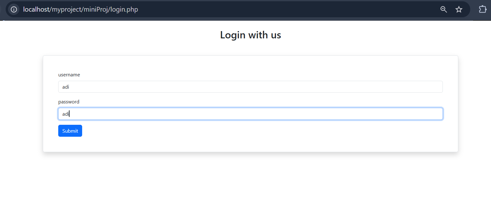
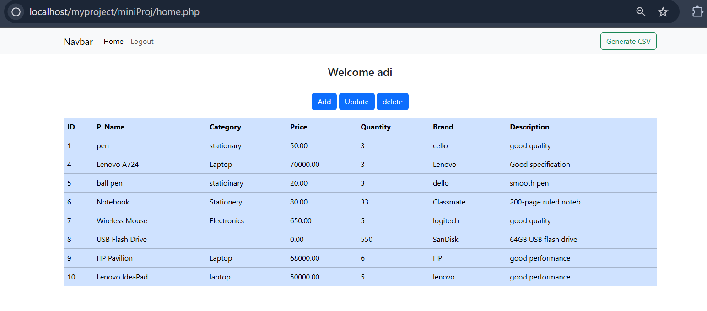
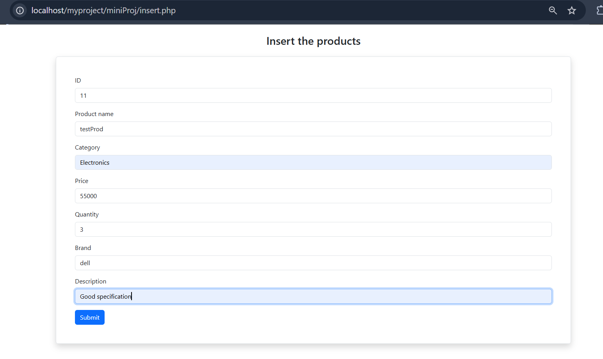
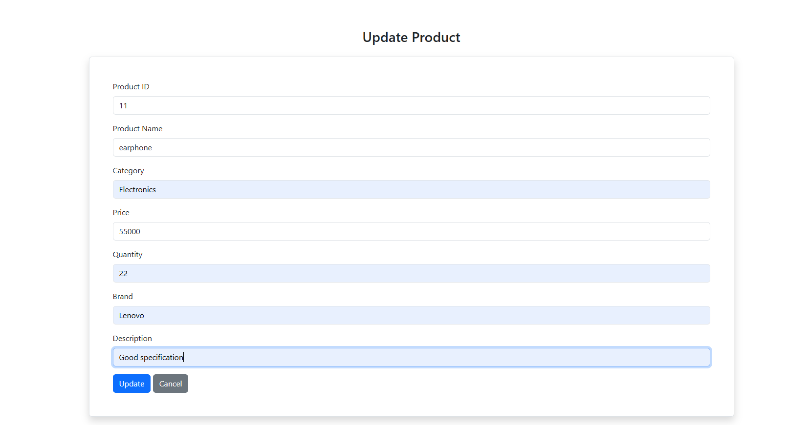

# PHP Mini Project

A simple **PHP & MySQL based web application** demonstrating user authentication and basic product management using CRUD operations.

## 🛠️ Technologies

* PHP
* MySQL
* HTML & CSS
* Bootstrap
* XAMPP

## ✨ Features

* User Registration & Login
* Session-based Authentication
* Add Products
* View Products
* Update Products
* Delete Products
* Export Products to CSV

## 🔄 Workflow

```text
Register
   ↓
Login
   ↓
Home / Products
   ↓
┌─────────┬─────────┬─────────┐
│  Insert │  Update │  Delete │
└─────────┴─────────┴─────────┘
   ↓
MySQL Database
   ↓
CSV Export
```

## 📸 Screenshots

### Login



### Home



### Add Product



### Update Product



## 🚀 How to Run

1. Install **XAMPP**.
2. Clone the repository:

```bash
git clone https://github.com/Aditya-deshmukh-1410/PHP-Mini_Project.git
```

3. Move the project to:

```text
C:\xampp\htdocs\
```

4. Start **Apache** and **MySQL** from XAMPP.
5. Create the required database in **phpMyAdmin**.
6. Configure the database connection in `db.php`.
7. Open the project:

```text
http://localhost/PHP-Mini_Project/
```

## 👨‍💻 Author

**Aditya Deshmukh**

[GitHub](https://github.com/Aditya-deshmukh-1410)
