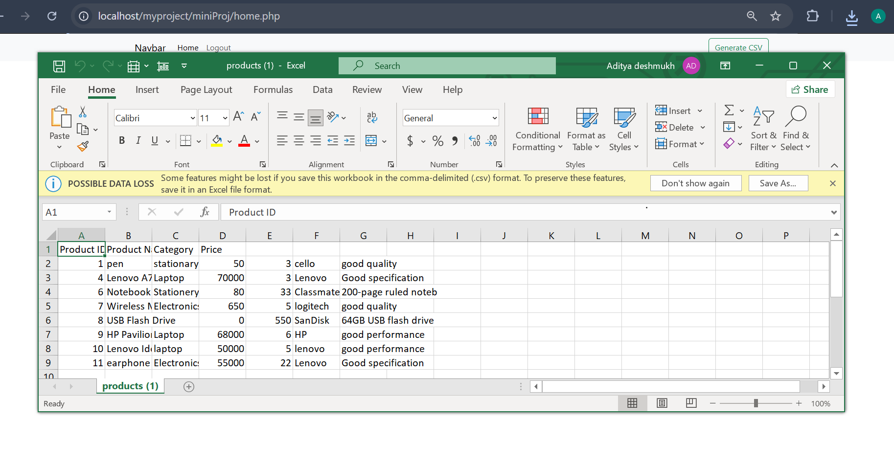

<h1 align="center">PHP Mini Project</h1>
<p align="center"> <b>A simple PHP & MySQL web application for managing products with user authentication and CRUD operations.</b> </p>

<p align="center">      </p>


## 🛠️ Technologies

* PHP
* MySQL
* HTML & CSS
* Bootstrap
* XAMPP

## ✨ Features

* User Registration & Login
* Session-based Authentication
* Add Products
* View Products
* Update Products
* Delete Products
* Export Products to CSV

## 🔄 Workflow

```text

┌──────────────┐
│   Register   │
└──────┬───────┘
       ↓
┌──────────────┐
│     Login    │
└──────┬───────┘
       ↓
┌──────────────┐
│    Home /    │
│   Products   │
└──────┬───────┘
       ↓
┌─────────┼─────────┐
↓         ↓         ↓
Insert   Update    Delete
│         │         │
└─────────┼─────────┘
          ↓
┌──────────────┐
│    MySQL     │
│   Database   │
└──────┬───────┘
       ↓
┌──────────────┐
│  CSV Export  │
└──────────────┘
```

## 📸 Screenshots

### Login


### Home


### Add Product


### Update Product


### CSV File



## 🚀 How to Run

1. Install **XAMPP**.
2. Clone the repository:

```bash
git clone https://github.com/Aditya-deshmukh-1410/PHP-Mini_Project.git
```

3. Move the project to:

```text
C:\xampp\htdocs\
```

4. Start **Apache** and **MySQL** from XAMPP.
5. Create the required database in **phpMyAdmin**.
6. Configure the database connection in `db.php`.
7. Open the project:

```text
http://localhost/PHP-Mini_Project/
```

## 👨‍💻 Author

**Aditya Deshmukh**

[GitHub](https://github.com/Aditya-deshmukh-1410)
